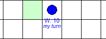

# AI_Quoridor_game_project

An intelligent and interactive 4-player version of the strategic board game **Quoridor**, built with Python and Tkinter. This project demonstrates **Minimax algorithm with Alpha-Beta pruning** in a dynamic, adversarial, multi-agent environment.

---
## Project Report


--- 

## 🎮 Game Description

**Quoridor** is a pathfinding strategy game where players race to reach the opposite side of the board while placing walls to block opponents — without completely trapping them. Our version enhances this classic:

- 🧩 **Supports 1–4 players** (Human or AI-controlled)
- 🧱 **Wall placement logic** with ghost preview, validation, and visual feedback
- 🔁 **Turn-based logic** with “my turn” indicators
- 🧠 **AI decision-making** using Minimax with Alpha-Beta pruning
- ⏱️ **Real-time timer** and wall counters for each player

---

## 🧑‍💻 How to Play

- 🔵 **Move**: Click an adjacent cell to move your pawn.
- 🧱 **Place Walls**:
  - Press `H` for **horizontal** wall mode
  - Press `V` for **vertical** wall mode
  - Click to place wall along cell boundary
- ❌ Press `ESC` to exit wall mode
- 🏁 First player to reach their **goal side** wins!

> You must **not block all paths** with your wall placement.

---

## 🚀 Getting Started

### 📦 Requirements

- Python 3.8+
- Tkinter (usually bundled with Python)

### ▶️ Run the Game

```bash
python quoridor_gui.py
```
Note: Upon launch, you will be asked to enter the number of human players (1 to 4). AI bots will auto-fill the remaining slots.

---

### 💡 Features
| Feature                  | Description                                                     |
| ------------------------ | --------------------------------------------------------------- |
| 🧠 AI Decision Engine    | Minimax + Alpha-Beta pruning for smart wall/move decisions      |
| 👥 1–4 Players Supported | Mix of humans and AI with dynamic handling                      |
| 🧱 Wall Logic            | Validated placement, ghost preview, grid snapping               |
| 🎨 Interactive GUI       | Made with Tkinter: hover effects, pawn rendering, wall counters |
| 🔢 Wall Counters         | Real-time display of remaining walls for each player            |
| ⏱️ Game Timer            | Tracks how long the session has been running                    |
| 📜 How-To-Play Help      | “?” button shows in-game instructions                           |

---

### 🧠 AI Logic (Minimax + Alpha-Beta)
Each AI agent:
- Calculates its shortest path to goal using BFS
- Considers all valid moves and wall placements
- Prunes the decision tree for faster performance
- Occasionally places walls strategically to delay others
- The evaluation function minimizes its own distance to goal while maximizing the obstacle for others.

---

### 📁 Project Structure
```graphql
AI project/
├── quoridor_game.py      # Game logic and AI (Minimax, wall validation, pathfinding)
├── quoridor_gui.py       # GUI interface using Tkinter
```

### 🧱 Project Structure and Function Signatures
### 📄 quoridor_game.py
Contains all core logic for the game, including movement, wall rules, and AI.
### Class: QuoridorGame
```python
class QuoridorGame:
    def __init__(self, humanPlayers: list)

    def getLegalMoves(self, playerId: int) -> list
    def applyMove(self, playerId: int, action: tuple) -> None
    def isWallValid(self, orientation: str, x: int, y: int) -> bool
    def isWallBlocking(self, fromCell: tuple, toCell: tuple) -> bool
    def getPlayerAt(self, x: int, y: int) -> Optional[int]
    def getGoalDistance(self, start: tuple, playerId: int) -> int
    def checkOccupied(self, x: int, y: int) -> bool
    def checkWin(self, playerId: int) -> bool
```
### Class: AlphaBetaAgent
```python
class AlphaBetaAgent:
    def __init__(self, playerId: int, depth: int = 1)

    def getBestAction(self, gameRef: QuoridorGame) -> Optional[tuple]
    def minimax(self, gameRef: QuoridorGame, depth: int,
                alpha: float, beta: float, isMaximizing: bool,
                playerId: int) -> tuple[float, Optional[tuple]]
    def evaluateState(self, gameRef: QuoridorGame) -> float
```
### 📄 quoridor_gui.py
Implements the graphical interface using tkinter.
### Class: QuoridorInterface
```python
class QuoridorInterface:
    def __init__(self, root: tk.Tk, humanPlayers: list)

    def setWallMode(self, mode: Optional[str]) -> None
    def showInstructions(self) -> None
    def handleClick(self, event: tk.Event) -> None
    def handleHover(self, event: tk.Event) -> None
    def tryPlayerMove(self, x: int, y: int) -> None
    def tryWallPlacement(self, px: int, py: int) -> None
    def aiPlay(self) -> None
    def advanceTurn(self) -> None
    def updateTurnInfo(self) -> None
    def updateTimer(self) -> None
    def drawBoard(self) -> None
```
### 🔁 __main__ Launch Block
```python
if __name__ == "__main__":
    root = tk.Tk()
    numHumans = simpledialog.askinteger(...)
    humanPlayers = list(range(1, numHumans + 1))
    app = QuoridorInterface(root, humanPlayers)
    root.mainloop()
```
---
### 📸 Gameplay Screenshots

Here are gameplay snapshots of the Quoridor AI game:
<br>
Step 01: Open this folder in your favuorite python IDE like I used Visual Studio Code


<br>
<br>
Step 02: Run this command to execute quoridor_gui.py file to start the game


<br>
<br>
Step 03: Choose the number of human players, the rest of the players left will be AI bots implementing alpha beta alongwith minimax algo


<br>
<br>
Step 04: Click on the new GUI window opened


<br>
<br>
Step 05: Click on "?" button to learn the rules of the game and knowledge about the developers


<br>
<br>
Step 06: Legal moves are ghost-shadowed as green on mouse-hover on the cells of the grid


<br>

<br>

<br>
<br>
Step 07: Illegal moves are ghost-shadowed as red on mouse-hover on the cells of the grid


<br>

<br>
<br>
Step 08: Took my turn by moving one cell forward, and consequently other opponent pawns (AI bots here) took their turn also by maxmizing their goal using minimaz and alphabeta along with BFS


<br>
<br>
Step 09: On pressing "h" horizontal wall mode is activated, after which wall is ghost-shadowed as brown on the cell boundaries on mouse-hover


<br>
<br>
Step 10: After clicking the wall at the suitable place, the wall is placed covering two cells and the wall mode is turned off automatically, or you can press 'esc' button to come out of the wall mode without placing it


<br>
<br>
Step 11: On pressing "v" vertical wall mode is activated, after which wall is ghost-shadowed as brown on the cell boundaries on mouse-hover


<br>
<br>
Step 12: After clicking the wall at the suitable place, the wall is placed covering two cells and the wall mode is turned off automatically, or you can press 'esc' button to come out of the wall mode without placing it


<br>
<br>
Step 13: Here, red pawn (AI bot) reached the opposite side first, so it is declared winner. It shows how intelligent AI bots in term of adversary using alpha beta pruning that they try to win in the minimum and optimal moves. AI bots can also place walls against each other, but they did not do it because they did not find it maximizing their goal.


<br>
<br>
Note: You can choose any number of human players upto 4 depending upon the number of multiplayers, and the rest of the pawns will be AI agents running their individual alpha beta algorithms


<br>

<br>

<br>


---

### 👨‍🏫 Developed By:
- Muhammad Umer Ahmed Abbasi – 22K-4599 (Group Leader)
- Jawwad Ahmed – 22K-4648
- Muhammad Talha Asim – 22K-4589
-📘Section: BCS-6C
-📘Course: Artificial Intelligence
-📘Instructor: Sir Abdullah Yaqoob

---

### 🏁 License
This project is intended for academic use only. All AI strategies and GUI elements were built from scratch by the team.

